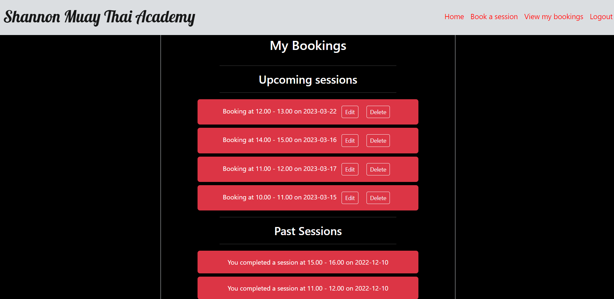

# **_Shannon Muay Thai Academy_**

Shannon Muay Thai Academy is a muay thai kickboxing gym located in Shannon, Co. Clare. This website is designed users information about both the gym and the sport, and for users to be able to request private training sessions at times that suit them. 

Welcome to the <a href="https://pp4-django-bookings.herokuapp.com/" target="_blank" rel="noopener">Shannon Muay Thai Academy</a> Website.

# Contents

* [**User Experience UX**](<#user-experience-ux>)
    *  [User Stories](<#user-stories>)
    * [Design Choices](<#design-choices>)
    *  [Typography](<#typography>)
    *  [Colour Scheme](<#colour-scheme>)
* [**Features**](<#features>)
    * [**Existing Features**](<#existing-features>)
         * [How To Play](<#how-to-play>)
         * [Dealer Cards](<#dealer-cards>)
         * [Player Cards](<#player-cards>)
         * [Game Buttons](<#game-buttons>)
         * [Responsiveness](<#responsiveness>)
    * [**Future Features**](<#future-features>)
* [**Technologies Used**](<#technologies-used>)
* [**Debugging**](<#debugging>)
* [**Testing**](<#testing>)
* [**Deployment**](<#deployment>)
* [**Credits**](<#credits>)
    * [**Content**](<#content>)
    * [**Media**](<#media>)
*  [**Acknowledgements**](<#acknowledgements>)

# User Experience (UX)

## User Stories

* As a user I want to clearly see information about class times.
* As a user I want to see information about the background of the club and sport.
* As a user I want to be able to book training sessions easily on the website.
* As a user I want to have access to all my currently booked private sessions.
* As a user I want to be able to delete any currently booked private session.
* As a user I want to be able to register for an account.
* As a user I want to be able to easily log in and log out.

[Back to top](<#contents>)
## Design Choices

 * ### Typography
      The font I chose for the title in the navbar was 'Lobster', which I found on <a href="https://fonts.google.com/" target="_blank" rel="noopener">Google Fonts</a>.
      I chose this font as it was close to the style of the gyms actual logo title font.
    

      For the remainder of the website I left the font as the default boostrap font, as it hsa a clean, legible look.

 * ### Colour Scheme
      The colour scheme eventually chosen is mostly black with a secondary color of light grey as that is the color of the gyms clothing items. I added red to the navbar links and the users bookings to make them stand out and prevent the website from having a two tone color palette.

[Back to top](<#contents>)
# Features

The gyms website is designed to be easy for users to navigate and simple for users to make bookings.

## Existing Features  
  * ### User accounts

    * Users are able to create accounts quickly, with cleary laid out steps.
    

    * If the user already has an account, there is a login page where the user only has to provide their username and password. If the user logs in correctly they are brought to the homepage with a message confirming they logged in.
    
    

    * Both login and register pages have messages to say if there was an error and asking the user to try again.
    

    * Once logged in, the login and register pages become hidden in the navbar and instead there is a logout option. The View bookings page also now becomes available.
    

    * When logging out, the user the then redirected to the login page with a message to confirm logout has been carried out successfully.
    

[Back to top](<#contents>)

  * ### Bookings

      * If logged in, the user is able book private training sessions through the bookings page. First the user if brought a page where they select the date they want to make the booking.
      

      * If the user tries to pick a date that has already passed they receive an invalid date message.
            

      * If the user tries to pick the current date they will get this message.
            

      * The user is then brought to a page where they can pick what time they would like to book the session for. The user is only given the option for times that have not been booked yet.
      

      * If there is no available times left on the date chosen the user is asked to choose a different date with a link back to the date picker page.
      

      * Once a booking is made the user is brought to a confirmation page with a link to view all of their bookings.
      

      * On the view bookings page, the bookings the user sees are broken up into past and upcoming bookings. If the user deletes a booking then a message pops up to confirm deletion.
      

  * ### Resonsiveness
      * The website is responsive accross all screen sizes. On small screen sizes the images and content stack ontop each other. The logo title in the navbar also changes to a picture of the gyms logo to keep the website looking neat and legible. The website was tested on the following browsers with no visible issues for the user. Google Chrome, Microsoft Edge and Mozilla Firefox.

      * The responsive design tests were carried out manually with [Google Chrome DevTools](https://developer.chrome.com/docs/devtools/).

|        | Moto G4 | Galaxy S5 | iPhone 5 | iPad | Display <1200px | Display >1200px |
|--------|---------|-----------|----------|------|-----------------|-----------------|
| Render | pass    | pass      | pass     | pass | pass            | pass            |
| Images | pass    | pass      | pass     | pass | pass            | pass            |
| Links  | pass    | pass      | pass     | pass | pass            | pass            |

## Future Features 

* Adding the merchandise to be available for purchase on the website.
* Having users be able to purchase their gym membership or private training sessions through the website.
* An events page, so people can keep up to date on any events ranging from fights that members are competing in to kids events and seminars being held in the gym.

[Back to top](<#contents>)

# Technologies Used
* [HTML5](https://html.spec.whatwg.org/) - provides the content and structure for the website.
* [CSS](https://www.w3.org/Style/CSS/Overview.en.html) - provides the styling.
* [Javascript](https://www.javascript.com/) - provides the logic for the website.
* [Gitpod](https://www.gitpod.io/#get-started) - used to deploy the website.
* [Github](https://github.com/) - used to host and edit the website.

[Back to top](<#contents>)

# Debugging

## Available Times
* While making this website encountered many problems. The problem that I spent the most time figuring out was how to use only have the available times as options to book private sessions. I was able to display the available times in the dropdown menu, but whenever I would try to submit the form it would say that the form is invalid. 

* I was using a model form connected to the bookings model. I tried to set the fields required to false but the form was still invalid.

* I managed to get the form to work by only having the 'slot' field in the model form. 

## Date Form and Booking Form
* My main intention with the functionality for this webiste is that the user would first choose the date they wanted to have a private session, and then they would be able to see what times were available based on their choice. I decided to carry this out by having the user complete two forms to book a session, the first would be where they choose a date and the second would be where the available times are displayed. Carrying the chosen date from one form to another proved to be more difficult than expected.

* First I tried to store the first date chosen as a javascript variable which would then be called upon when the second form would load. This would not work however as I had the two forms on seperate templates so the javascript variable kept reseting when I would open the next page.

 
* I then changed my approach and changed how my booking form was set up. I initially had the Slot field as its own model, where I had all the slot times as model instances that the Booking model would point as a foreign key when making a booking. 

* I changed this to a tuple of times that would be available everyday. I also changed the datefield to a charfield. 

* I then took the input of the date form using [Djangos Sessions](https://docs.djangoproject.com/en/4.1/topics/http/sessions/) and converted it into a string, which would I then call upon in the booking form and use as the booking_date input instance when making a booking.

# Testing

## HTML testing

## CSS testing

## Lighthouse testing

## Django testing

### Forms testing

### Urls testing

### Views testing

