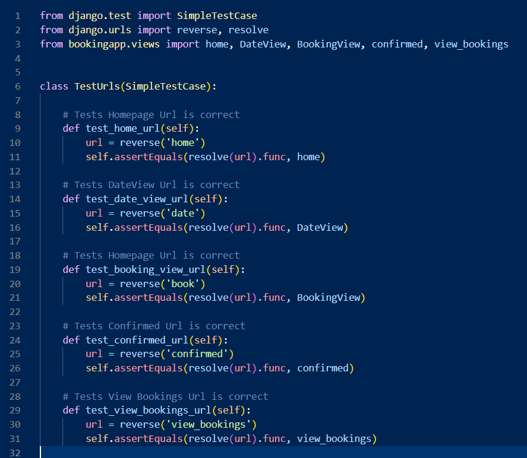

# **_Shannon Muay Thai Academy_**

Shannon Muay Thai Academy is a muay thai kickboxing gym located in Shannon, Co. Clare. This website is designed to give users information about both the gym and the sport, and for users to be able to request private training sessions at times that suit them. 

Welcome to the <a href="https://pp4-django-bookings.herokuapp.com/" target="_blank" rel="noopener">Shannon Muay Thai Academy</a> Website.

# Contents
* [**Project Management**](<#project-management>)
    *  [Trello](<#trello>)
* [**User Experience UX**](<#user-experience-ux>)
    *  [User Stories](<#user-stories>)
    *  [Wireframes](<#wireframes>)
    * [Design Choices](<#design-choices>)
    *  [Typography](<#typography>)
    *  [Colour Scheme](<#colour-scheme>)
* [**Features**](<#features>)
    * [**Existing Features**](<#existing-features>)
         * [User Accounts](<#user-accounts>)
         * [Bookings](<#bookings>)
         * [Responsiveness](<#responsiveness>)
    * [**Future Features**](<#future-features>)
* [**Technologies Used**](<#technologies-used>)
* [**Debugging**](<#debugging>)
    * [**Available Times**](<#available-times>)
    * [**Date Form and Booking Form**](<#date-form-and-booking-form>)
* [**Testing**](<#testing>)
* [**Deployment**](<#deployment>)
* [**Credits**](<#credits>)
    * [**Content**](<#content>)
    * [**Media**](<#media>)
*  [**Acknowledgements**](<#acknowledgements>)

# Project Management

## Trello

* For this project I have used Trello to manage my projects progress. I mapped out all the user stories for the website to trello and used it to ensure the progress on this website was moving efficiently. The major milestones I had when creating this project were the booking and user and login functionality as they were the very core of the website itself.

# User Experience (UX)

## User Stories

### Viewing And Navigation
* As a user I want to clearly see information about class times.
* As a user I want to see information about the background of the club and sport.
* As a site user I want to have access to the website through any device.
* As a site user I want to have access to all pages through the navbar.
* As a site user I want to be able to view contact information for the business.

### Registration And User Accounts
* As a user I want to be able to register for an account.
* As a user I want to be able to easily log in and log out.
* As a user I want to visual confirmation when logging in and out.

### Bookings
* As a user I want to be able to see what time-slots are available on specific dates.
* As a user I want to be able to book training sessions easily on the website.
* As a user I want to have access to all my currently booked private sessions.
* As a user I want to be able to delete or edit any currently booked private session.
* As a user I want to visual confirmation when adding or changing a booking.

[Back to top](<#contents>)

## Wireframes

* These wireframes were produced in [Figma](https://figma.com). I made frames for a full width display and then modeled for smaller screens once I had designed the full width diplay. The finished site varies slightly from the wireframes due to developments that occured during the creation process.

* For smaller screens I condensed the website down and stacked content on top of each other. I also removed the gyms title logo from the navbar and replaced it with the gyms logo to keep the navbar from looking overcrowded. I also used a responsive navbar that included a dropdown menu on smaller screens from [boostrap](https://getbootstrap.com/docs/4.0/components/navbar/).

[Back to top](<#contents>)
## Design Choices

 * ### Typography
      The font I chose for the title in the navbar was 'Lobster', which I found on <a href="https://fonts.google.com/" target="_blank" rel="noopener">Google Fonts</a>.
      I chose this font as it was close to the style of the gyms actual logo title font.

    

      For the remainder of the website I left the font as the default boostrap font, as it has a clean, legible look.

 * ### Colour Scheme
      The colour scheme eventually chosen is mostly black with a secondary color of light grey as that is the color of the gyms clothing items. I added red to the navbar links and the users bookings to make them stand out and prevent the website from having a two tone color palette. I also had originally set the opacity of the navbar to 0.8 as I liked how it sat on the screen with the hero image. I noticed this could have some legibility issues when the user begins to scroll so I have the opacity change to 1 once the user scrolls 50 pixels.

[Back to top](<#contents>)
# Features

The gyms website is designed to be easy for users to navigate and simple for users to make bookings.

## Existing Features  
  * ### User accounts

    * Users are able to create accounts quickly, with cleary laid out steps.

    

    * If the user already has an account, there is a login page where the user only has to provide their username and password. If the user logs in correctly they are brought to the homepage with a message confirming they logged in.

    
    

    * Both login and register pages have messages to say if there was an error and asking the user to try again.

    

    * Once logged in, the login and register pages become hidden in the navbar and instead there is a logout option. The View bookings page also now becomes available.

    

    * When logging out, the user is then redirected to the login page with a message to confirm logout has been carried out successfully.

    

[Back to top](<#contents>)

  * ### Bookings

      * If logged in, the user is able book private training sessions through the bookings page. First the user is brought to a page where they can select the date they want to make the booking for.

      

      * If the user tries to pick a date that has already passed they receive an invalid date message.

            

      * If the user tries to pick the current date they will get this message.

            

      * The user is then brought to a page where they can pick what time they would like to book the session for. The user is only given the option for times that have not been booked yet.

      

      * If there is no available times left on the date chosen, the user is asked to choose a different date with a link back to the date picker page.

      

      * Once a booking is made the user is brought to a confirmation page with a link to view all of their bookings.

      

      * On the view bookings page, the bookings the user sees are broken up into past and upcoming bookings. If the user deletes a booking then a message pops up to confirm deletion.

      

      * If the user clicks on the edit session button, they are asked to choose another date and time. Before they complete changing their booking details, they are given this pop up message to confirm that their old session will be deleted and replaced with the new one.

      

  * ### Responsiveness
      * The website is responsive accross all screen sizes. On small screen sizes the images and content stack ontop each other. The website was tested on the following browsers with no visible issues for the user. Google Chrome, Microsoft Edge and Mozilla Firefox.

      * The responsive design tests were carried out manually with [Google Chrome DevTools](https://developer.chrome.com/docs/devtools/).

|        | Moto G4 | Galaxy S5 | iPhone 5 | iPad | Display <1200px | Display >1200px |
|--------|---------|-----------|----------|------|-----------------|-----------------|
| Render | pass    | pass      | pass     | pass | pass            | pass            |
| Images | pass    | pass      | pass     | pass | pass            | pass            |
| Links  | pass    | pass      | pass     | pass | pass            | pass            |

# Models 
* For this project, I only have one custom django model- The Booking model. This model has 3 fields- The slot field, the user field and the booking date field. The slot field is the time that the booking will take place. This comes from a tuple called Slots. The user field is whichever user is logged in when the booking is reserved. And finally the booking date field is a charachter field which stores the date of the booking. I originally had this as a datefield but changed it as I talk about [here](<#date-form-and-booking-form>).

[Back to top](<#contents>)

## Future Features 

* Adding the merchandise to be available for purchase on the website.
* Having users be able to purchase their gym membership or private training sessions through the website.
* An events page, so people can keep up to date on any events ranging from fights that members are competing in to kids events and seminars being held in the gym.

[Back to top](<#contents>)

# Technologies Used
* [HTML5](https://html.spec.whatwg.org/) - provides the content and structure for the website.
* [CSS](https://www.w3.org/Style/CSS/Overview.en.html) - provides the styling.
* [Javascript](https://www.javascript.com/) - used to change opacity of the navbar when scrolling.
* [Heroku](https://dashboard.heroku.com/) - used to deploy the website.
* [Git](https://git-scm.com/) - Used for version control
* [Github](https://github.com/) - used to host and edit the website.
* [VSCode](https://code.visualstudio.com/) - Used for writing all the websites code.
* [Django](https://www.djangoproject.com/) - a python framework, used for linking logic and templates and forms. The backbone of the website.
* [Boostrap](https://getbootstrap.com/) - used for quick and effective styling aswell as responsive navbar templates and responsiveness.
* [Cloudinary](https://cloudinary.com/) - used for storing images.
* [PostgreSQL](https://www.postgresql.org/) - Database used.
* [ElephantSQL](https://www.elephantsql.com/) - A PostgreSQL database hosting service.

[Back to top](<#contents>)

# Debugging

## Available Times
* While making this website I encountered many problems. The problem that I spent the most time figuring out was how to use only have the available times as options to book private sessions. I was able to display the available times in the dropdown menu, but whenever I would try to submit the form it would say that the form is invalid. 

* I was using a model form connected to the bookings model. I tried to set the fields required to false but the form was still invalid.

* I managed to get the form to work by only having the 'slot' field in the model form. 

## Date Form and Booking Form
* My main intention with the functionality for this webiste is that the user would first choose the date they wanted to have a private session, and then they would be able to see what times were available based on their choice. I decided to carry this out by having the user complete two forms to book a session, the first would be where they choose a date and the second would be where the available times are displayed. Carrying the chosen date from one form to another proved to be more difficult than expected.

* First I tried to store the first date chosen as a javascript variable which would then be called upon when the second form would load. This would not work however as I had the two forms on seperate templates so the javascript variable kept resetting when I would open the next page.

 
* I then changed my approach and changed how my booking form was set up. I initially had the Slot field as its own model, where I had all the slot times as model instances that the Booking model would point as a foreign key when making a booking. 

* I changed this to a tuple of times that would be available everyday. I also changed the datefield to a charfield. 

* I then took the input of the date form using [Djangos Sessions](https://docs.djangoproject.com/en/4.1/topics/http/sessions/) and converted it into a string, which would I then call upon in the booking form and use as the booking_date input instance when making a booking.

# Testing

## HTML testing

## CSS testing

## Lighthouse testing

## Django testing

### Forms testing

### Urls testing

### Views testing

## Manual Testing
Manual tests were performed on all the user stories

### Viewing And Navigation
* As a user I want to clearly see information about class times.

  * Class times are displayed at the top of the home page.

* As a user I want to see information about the background of the club and sport.

  * At the bottom of the home page, all information is available on the club and history of the sport.

* As a site user I want to have access to the website through any device.

  * Website is [responsive](<#responsiveness>) on all screen sizes and browsers.

* As a site user I want to have access to all pages through the navbar.

  * All pages of the site are accessible through the navigation bar which always appears at the top of the page.

* As a site user I want to be able to view contact information for the business.

  * Contact information and the gyms address is available in the website footer.

### Registration And User Accounts
* As a user I want to be able to register for an account.

  * If not logged in, there is a 'Make an account' link to the registration page in the navbar.

* As a user I want to be able to easily log in and log out.

  * A user can login or logout through the navbar at any time.

* As a user I want to visual confirmation when logging in and out.

  * Upon logging in the user is taken to the home page with a message confirming they have logged in. When logging out, the user is brought to the login page with a message to confirm they have logged out.

### Bookings
* As a user I want to be able to see what time-slots are available on specific dates.

  * If logged in, the user can choose a date they would like to book a session. They are then brought to a page where a dropdown menu displays any available sessions left on that day. If the day is fully booked, there is a message asking them to choose another day, with a link back to the previous page.

* As a user I want to be able to book training sessions easily on the website.

  * Once logged in, a user can book any available session at least a day in advance through the 'Book a session' link in the navbar.

* As a user I want to have access to all my currently booked private sessions.

  * A user can look through any of their booked sessions, both upcoming and previous, in the 'View my Bookings' link in the navbar.

* As a user I want to be able to delete or edit any currently booked private session.

  * On the 'View my Bookings' page, there are two buttons 'Edit' and 'Delete' where the user can make changes or completely delete their booking. If they try to delete their booking they are met with a pop up confirming their action, to prevent accidental deletions. 

* As a user I want to visual confirmation when adding or changing a booking.

  * Upon adding/editing a booking, the user receives a confirmation message to confirm their actions.

### Deployment

**Deploying to Heroku**

Requirements:

* A Heroku account (Free or Paid)
* ClearDB MySQL (Free or Paid)
* ALLOWED_HOSTS - Must contain the Heroku URL
* Procfile - Tells Heroku what kind of app it is `web: gunicorn issue_tracker.wsgi`
* requirements.txt file - Containing all of the required dependencies `guinicorn must be in requirements.txt for Heroku`

To deploy my project, I decided to go with [Heroku](https://www.heroku.com/). It was relatively straight forward and only took a matter of minutes before I had the project pushed from my local machine to a live production ready server. Although, if the project got more than a few users I would have to pay for ClearDB using Heroku as the free tier is very limited.

I have broken my deployment process up into several simple steps:

**$ notes a terminal command**

* Login to access the Heroku Dashboard
* On the dashboard, create a new app, choosing a name and region.
* Set up my Django project for hosting with Heroku:
  * Added my Heroku app URL to ALLOWED_HOSTS in settings.py
  * Created a Procfile `web: gunicorn issue_tracker.wsgi`
  * Installed guinicorn `$ pip install guinicorn` 
  * Updated dependencies `$ pip freeze --local > requirements.txt`
* Click on the newly created app to bring up more information- select `Resources`.
* I then added ClearDB MySQL as a resource and made note of the SQL database details it provided:
  * Database Name
  * Username
  * Password
  * Host
* I then added in all of my Config Vars by going to `Settings` in the Heroku top navigation bar.
  * DB_NAME - Provided by ClearDB MySQL
  * DB_USER - Provided by ClearDB MySQL
  * DB_PASSWORD - Provided by ClearDB MySQL
  * DB_HOST - Provided by ClearDB MySQL
  * DB_PORT - Usual 3306
* I also added `DISABLE_COLLECTSTATIC` with a value of `1` to my config vars as I collected my static files manually later.
* I then moved on to the `Deploy` tab in the Heroku top navigation bar.
* I opted to install the Heroku CLI as I'd need to run commands later such as migrate, collectstatic etc.
* I then ran the following commands in my terminal ensuring I was in the correct directory (my project directory):
  * `$ heroku login`
  * `$ git add .`
  * `$ git commit -m 'added Heroku Procfile and requirements`
  * `$ git push heroku master`
  * `$ heroku run python manage.py makemigrations`
  * `$ heroku run python manage.py migrate`
  * `$ heroku run python manage.py collectstatic`
  * `$ heroku run python manage.py createsuperuser`
* I then restarted all dynos to restart the app.
* The application was then live, and I began to populate it.

**Deploying on a local machine for testing**

Requirements:

* Terminal
* Python 3.6+
* PIP
* MySQL (Unless you change the Database Default to sqlite in settings.py)

I would highly recommend installing some kind of virtual environment to ensure that each project has it's own dependencies.

Please also note that these commands may differ from OS to OS.

**$ notes a terminal command**

* Firstly, with MySQL installed on your local machine, open up a terminal and enter:
  * `$ mysql -u <USERNAME> -p`
  * Type in your password, it will display as blank.
  * `$ create database <DATABASE_NAME>;`
  * `$ exit;`
* Now, create a directory somewhere on your hard drive.
* Open up a terminal in the designated directory by either right clicking and pressing `Open in Terminal` or using your keyboard shortcut to open terminal (in my case, `Super + T`).
* Now, if you have gone ahead and installed virtualenv you can enter into the terminal:
  * `$ virtualenv -p python3 .`
  * Note: there are other methods of doing this, so please see the documentation for more info.
  * Once the virtual environment has completed setup:
  * `$ source bin/activate` to activate the virtual environment.
  * I suggest making a directory now called `src` or similar, to host the project files, and then change directory into there.
  * Now, clone the project.
  * `$ git clone git@github.com:Gallie83/PP4-Django.git .` if using SSH.
  * `git clone https://github.com/Gallie83/PP4-Django.git .` if using HTTPS.
  * This will unpack the files into the src file.
* Now run the following command:
  * `$ pip install -r requirements.txt` to install all the project requirements.
* Once everything is installed, open up the project inside your code editor of choice.
* Head over to `issue_tracker/settings.py` in here be sure to do two things:
  * Change `DEBUG = False` to `DEBUG = True` to ensure static/media files are served correctly.
  * Either change the database none environment vars to match your own database or move to the next step.
* Adding in environment variables:
  * Open up your file manager, go to your root directory `~/` and show hidden files, however you do it on your OS. For me, there is a hamburger menu with the option to show hidden files.
  * From there, open up .bashrc in your editor of choice.
  * Here is a list of all the environment variables
    * SECRET_KEY - Optional, as you can enter a local string after the os.environ.get if you prefer.
    * DB_NAME - Optional, as you can enter a local string after the os.environ.get if you prefer.
    * DB_USER - Optional, as you can enter a local string after the os.environ.get if you prefer.
    * DB_PASSWORD - Optional, as you can enter a local string after the os.environ.get if you prefer.
    * DB_HOST - Optional, as you can enter a local string after the os.environ.get if you prefer.
    * DB_PORT - Optional, as you can enter a local string after the os.environ.get if you prefer.
* Now everything is set up, go back to the terminal window with the virtualenv running.
* Then run the following:
  * `$ python manage.py makemigrations`
  * `$ python manage.py migrate`
  * `$ python manage.py createsuperuser`
  * `$python manage.py runserver`
* And then you're ready to go!

[Back to top](<#contents>)

# Credits
### Content

* The fonts came from [Google Fonts](https://fonts.google.com/).
* All code, except where otherwise specified, was written by me - Kevin Gallagher.

### Media
* The Hero Image came from [Unsplash](https://unsplash.com/).
* All other images came from the gyms [Instagram](https://www.instagram.com/shannon_muaythaiacademy/?hl=en) and [Facebook](https://www.facebook.com/profile.php?id=100063625269637)
[Back to top](<#contents>)

# Acknowledgements
The site was completed as a Portfolio 4 Project piece for the Full Stack Software Developer Diploma at [Code Institute](https://codeinstitute.net/). As such I would like to thank my mentor [Precious Ijege](https://www.linkedin.com/in/precious-ijege-908a00168/), the Slack community, and all at the Code Institute for their help and support. I would also like to thank my friend Luke Walsh, for helping me when some problems felt unsolvable. This project means a lot to me as I have trained at this gym since it opened and have seen it develop from the ground up. I am very proud and thankful that I was able to carry out this project. 

Kevin Gallagher 2022.

[Back to top](<#contents>)